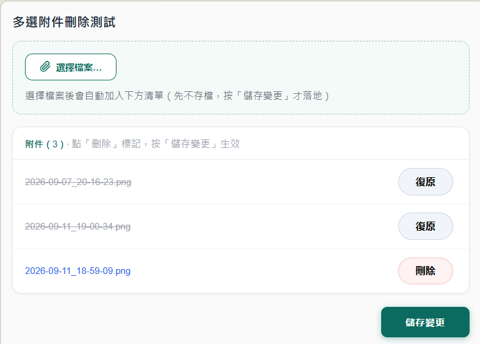

# domino-xpages-multi-attachment-delete

A minimal, **save-bounded multi-select attachment delete** for HCL Domino XPages.

The native XPages *File Download* control deletes attachments one at a time — there is no built-in "check several, delete together." This is a small reference XPage that adds it, the right way: it keeps the native **commit-on-save** behavior (nothing is written to disk until the user saves) and uses the data-source API `NotesXspDocument.removeAttachment`, not a back-end `Document.remove()` (which would risk save conflicts).

## What it does

- Lists the attachments on a rich text field (`getAttachmentList`).
- Each row has a **Delete / Undo** toggle — clicking it only *marks* the file (the row strikes through); nothing is deleted yet.
- Selecting files in the upload control adds them to the list (staged in memory).
- One **Save changes** button applies the new uploads and the marked deletions in a single document save.

Deletion follows the user's save — mark now, reversible until you save.

## Requirements

- HCL Domino / Domino Designer with XPages.
- Tested on Domino 12.0.2 FP8. The APIs used (`getAttachmentList`, `removeAttachment`) exist in earlier releases too.

## Setup

1. In a test database, create a form that has a **rich text field named `Body`** (the attachments live there). Give the form any name, e.g. `fmMultiDelTest`.
2. Add an XPage named `mdTest.xsp` and paste in [`mdTest.xsp`](mdTest.xsp).
3. Set the data source `formName` to your form's name. If you name the XPage something other than `mdTest.xsp`, update the two `redirectToPage("/mdTest.xsp?...")` calls to match.
4. Open the XPage in a browser (`.../<db>.nsf/mdTest.xsp`), add a few files, mark some for deletion, and press **Save changes**.

## How it works (the important bits)

- **Save-bounded delete**: `removeAttachment(field, name)` only takes effect on `doc.save()` — the [official docs](https://help.hcl-software.com/dom_designer/11.0.1/reference/r_wpdr_xsp_xspdocument_removeattachment_r.html) state "You must save the document for the change to take effect in the data store." Marking + a single save keeps everything transactional.
- **Marks are held in `viewScope`** (a map of filename → boolean); a partial refresh redraws the list, nothing hits disk until Save.
- **Uploads ride the same save**: the `xp:fileUpload` value is applied to `doc.Body` during Update Model, so the one `doc.save()` persists new files and deletions together.
- **Clear the upload input after each upload** (in `onComplete`), or `fileUpload` re-attaches the same file on the next submit and Domino renames the duplicate `-2`.
- **Don't drop to the back end**: mixing the data-source save with `doc.getDocument().getAttachment(name).remove()` can produce save conflicts. Stay at the data-source layer with `removeAttachment`.

## Known limitations

- `removeAttachment` matches by **filename**, so it can't distinguish two identically-named attachments on the same document — an inherent limit of a name-based API.
- No undo once saved. That is why "mark, reversible until save" matters.

## Writeup

Full walkthrough (HCL Domino 日報):

- English: https://bryanhsiao.github.io/domino-news/en/posts/xpages-attachment-multi-delete/
- 繁體中文: https://bryanhsiao.github.io/domino-news/posts/xpages-attachment-multi-delete/

## License

[Apache License 2.0](LICENSE). Copyright 2026 Bryan Hsiao.
